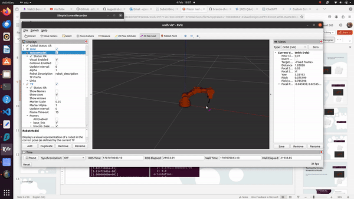

# Braccio pick and place Robot Arm

Welcome to my **Braccio Robot Arm** project! This repository houses my exploration into building a pick-and-place robot arm using the Braccio platform. The repo is constantly being updated, so the instructions may not work at times and the content may change!

## Goals

This project is for my personal exploration and enjoyment and to practise my skills with computer vision and writing inverse kinematic solvers!

## Overview

The **BraccioRobot Arm** is a fun and experimental project where I'm combining various technologies to create a chess-playing robot. The main components of this project are:

- **Braccio Robotic Arm:** I'm utilising the Braccio robotic arm to physically manipulate objects on the board.

- **Computer Vision:** I'm experimenting with computer vision techniques to enable the robot arm to "see" the chessboard and recognise the positions of the pieces.

- **ROS Integration:** I've integrated the Robot Operating System (ROS) to control the robot arm and facilitate communication between different components.

- **Inverse Kinematics:** For the movement of the robotic arm I will attempt to write an inverse kinematics solver.


## Prerequisites

There are **two branches. ros-1** branch that is not beening updated and **ros-2** which is activetly being updated.

#### ROS1
- ros (noetic)
- Ubuntu (20.04)
- numpy
- scipy
- matplotlib
- mpl_toolkits

#### ROS2
- ros2 (humble)
- Ubuntu (20.04)
- numpy
- scipy
- matplotlib
- mpl_toolkits
- colcon


## Building the code
#### First create a workspace:
```ruby
mkdir -p catkin_ws/src 
```
#### Clone the Repo in the source file:
```ruby
cd catkin_ws/src
git clone 
```
#### Build the repo:
- ROS1
```ruby
cd ..
catkin_make
source devel/setup.bash
```
- ROS2
```ruby
cd ..
colcon build
source install/local_setup.bash
```

## To run the Rviz Braccio IK demo (currently only in ROS1 ):

terminal 1:
```ruby
cd src/braccio_arduino_ros_rviz
roslaunch braccio_arduino_ros_rviz urdf.launch model:=urdf/braccio_arm.urdf
```


terminal 2:
```ruby
rosrun slow_braccio_ik incoming_request.py
```





**To test the code send a goal position either through a topic or using the purple goal arrow on Rviz. The code should return the position in a matplot figure and move the model on Rviz.**

## Repos used:

- https://github.com/ohlr/braccio_arduino_ros_rviz
- https://github.com/ros-drivers/rosserial
- https://github.com/leggedrobotics/darknet_ros

### Thank you for checking out my project!
### Future developments are documented in my Presentation file!!!!!


